# Avionics On Boarding Activity 

This activity will show how to connect an STM32 microcontroller to your laptop, program multiple LEDs to blink, and how to wire it all together


# Instructions 

## Step 1 - Install Arduino IDE

We will use the Arduino IDE for simple code editing and for uploading our code to the board. 

- Install Arduino IDE using the link below. Get the version which matches your operating system. 

https://www.arduino.cc/en/software

- You'll have to click "just download" several times to avoid donating 
- Once you install Arduino IDE, launch it and you see a screen like this:

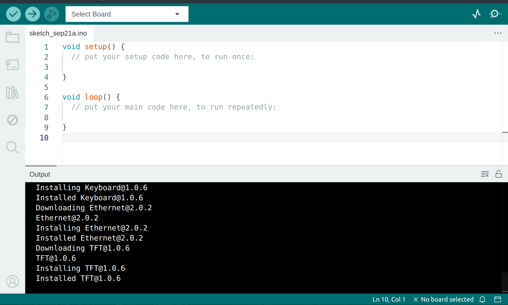


## Step 2 - Configure Arduino IDE for STM32

We have to install support for STM32 boards.   
Instructions taken from [here](https://community.st.com/t5/stm32-mcus/how-to-program-and-debug-the-stm32-using-the-arduino-ide/ta-p/608514), but the follow the
ones given below. 

### 2.1 Collecting the boards

Go to File > Preferences and then add the following URL to the "Additional Boards Managers URLs" field

https://github.com/stm32duino/BoardManagerFiles/raw/main/package_stmicroelectronics_index.json

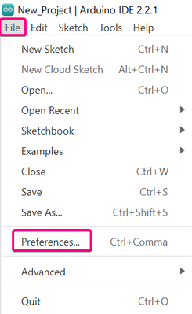
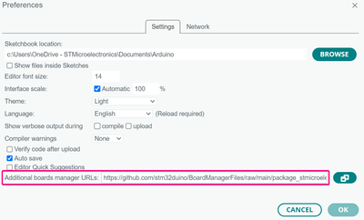

Add the URL given above to "Additional Boards Managers URLs" field and then click **OK**.

### 2.2 Installing the boards

Now, go to Tools > Board > Boards Manager

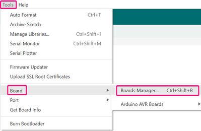

Within the board manager, select the "contributed" type and search for "STM32 MCU based boards" and then click **install**

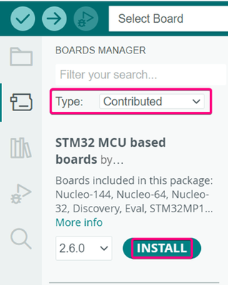


### 2.3 Selecting the board

Go to Tools > Board > STM32 MCU based boards

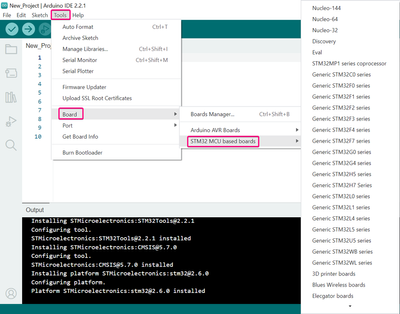

Select **Generic STM32L4 series**

### 2.4 Selecting the port 

Go to Tools > Port

Select the port which is connected to the STM32-Board

> **Note:** If the STM32 is not connected to your laptop over USB, then it will not show up under ports. 


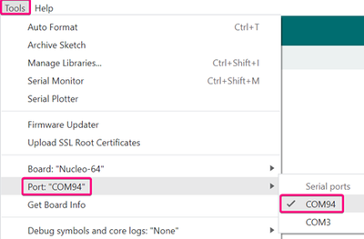

### 2.5 Select Board Part Number

Go to Tools > Board part number

Select "**Generic L412KBTx**"

### 2.6 Add the code

Add the template code found in [template.ino](template.ino)

There's a **copy** button in the top right to get all of the code.

Replace **ALL** of the code in the sketch with the template. 


## Step 3 - Install STM32CubeProgrammer 

Before you can upload and run the code, you need to have the STM32CubeProgrammer installed on your system.

The program can be installed from [here](https://www.st.com/en/development-tools/stm32cubeprog.html#get-software)

Scroll the red buttons near the bottom and install for the system you have. 

You'll be asked to give an email and then they will send the download link to that email. 

The download will include an installer. Run it and proceed through all of its steps. 

## Step 4 Wiring 


### 4.1 STM32 Nucelo Board
Place the STM32 Nucleo Board on the breadboard with the median separating the pins as such:

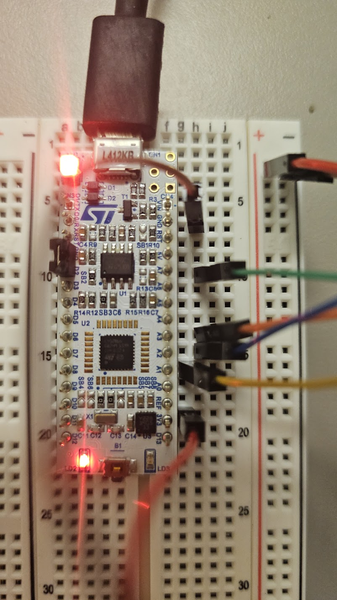

### 4.2 Wire the LEDs

Wire the LEDs with each being grounded through a resistor and being connected to pins on the STM32 board.

The smaller leg of the LED needs to be connected to ground while the longer leg should be connected to a GPIO pin on the STM32


| LED Color | STM32 Pin |
|-----------|-----------|
| Red | A1 |
| Green | A7 |
| Blue | A2 | 
| Orange (Looks white) | A3 | 

Make sure to ground each LED with a resistor.

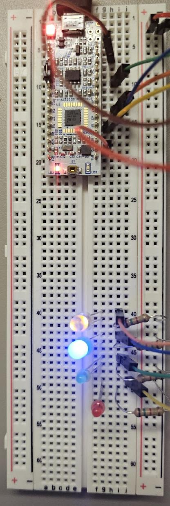


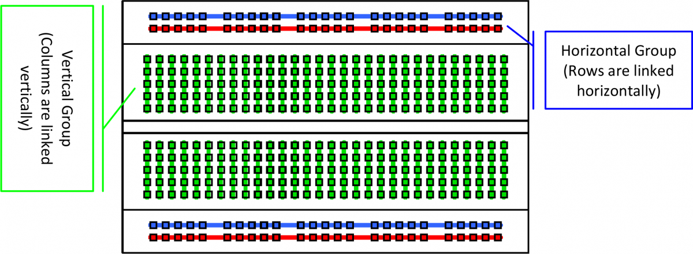 

> **Note** Connect the GND pin on the STM32 to the "-" channel on the breadboard to make it easier to connect each LED to ground via a resistor

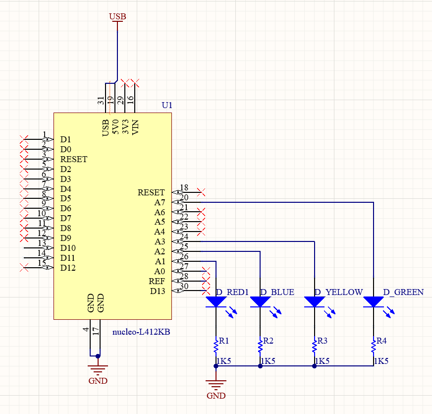

## Step 5 - Running your code

### 5.1 - Upload code 

Make sure the STM32 is connected via USB and select "Upload" on the Arduino IDE

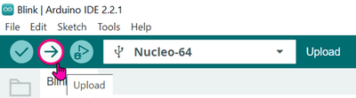

You should see the red LED start blinking, toggling every second. 

### 5.2 - Editing the code

Within the `setup` method, add the pin configuration commands for the green, blue, and white LEDs. 

```c++
// the setup function runs once when you press reset or power the board
void setup() {
  // initialize digital pins
  pinMode(RED, OUTPUT);
  
  // TODO: Initialize GREEN, BLUE, and WHITE below
  pinMode(GREEN, OUTPUT);
  ...

  // #################################################
}

```

Within the `loop` method, play around with toggle timings and try adding the other LEDs

```c++
// the loop function runs over and over again forever
void loop() {
  toggleLED(RED);
  delay(1000);
  
  // TODO: Toggle the GREEN, BLUE, and WHITE LEDs somewhere below 
  toggleLED(GREEN);
  ...

}
```

What kind of cool patterns can you make?